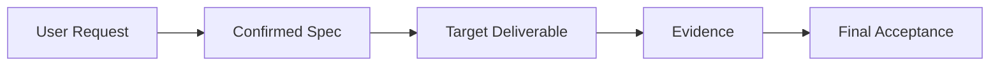

# SDD Quality Guarantee Output Contract

所有运行时最终文件均为 Markdown。默认输出根目录为 `output/<task-slug>/sdd-quality-guarantee/SDD/`。

## 1. `spec.md`

### 必须说明

- 任务标题、目标、背景和来源。
- 范围、非目标、假设、依赖和已确认约束。
- 输入、输出、数据结构、状态变化、用户/业务工作流。
- 异常分支、边界条件、禁止行为和外部副作用。
- 每条需求使用唯一 `SDD-REQ-001` 形式的 ID。

### 推荐结构

```markdown
# Spec

## Task Identity
## Background And Goal
## Scope
## Non-Goals
## Inputs And Outputs
## Workflow And State
## Requirements
| ID | Requirement | Source | Priority | Acceptance Anchor | Status |
| --- | --- | --- | --- | --- | --- |
## Constraints And Dependencies
## Risks And TBD
```

## 2. `acceptance.md`

每条验收标准使用唯一 `SDD-ACC-001` ID，并绑定 Spec、目标产物和证据。

```markdown
# Acceptance

## Gate Status
**Pass / Fail / Reject**

## Acceptance Matrix
| Acceptance ID | Spec ID | Expected Behavior | Evidence | Observed Result | Status |
| --- | --- | --- | --- | --- | --- |

## Workflow UAT
| Workflow | Input | Expected | Observed | Evidence | Status |
| --- | --- | --- | --- | --- | --- |

## Side-Effect And Readback
| Target | Action | Expected State | Readback | Status |
| --- | --- | --- | --- | --- |

## Blockers
## Non-Blocking Findings
## Verification Gaps
```

## 3. `diagram.md`

使用 Mermaid 表达最能帮助 Review 的关系。优先选择一种主图：流程图、架构图、状态图、数据流图或 Spec-to-Evidence 追踪图。图下必须附文字说明和图中未表达的边界。

```markdown
# Architecture And Traceability Diagram

## Diagram Type
## Mermaid



## Legend
## Scope Not Shown
```

## 4. `SDD.md`

`SDD.md` 是 Review 入口，不重复粘贴所有长内容，而是汇总和链接同目录 Markdown 文件。

```markdown
# SDD Quality Guarantee

## Review Summary
## Task And Scope
## Spec Summary
## Architecture Summary
## Acceptance Decision
## Evidence Index
## Requirement-to-Evidence Traceability
| Spec ID | Acceptance ID | TDD Case IDs | Evidence | Result |
| --- | --- | --- | --- | --- |
## Risks, Gaps And TBD
## Reviewer Checklist
## Linked Markdown Artifacts
```

## Evidence Language

- `Observed`: 有真实命令、解析结果、readback、截图或用户提供的可核验结果。
- `Inspected`: 通过静态文件或结构检查确认，但未执行完整流程。
- `Inferred`: 基于上下文推断，只能作为风险或待确认项。
- `Not Executed`: 计划存在但本次未执行。

不得用 `Inferred` 证据支撑 `Pass`。
